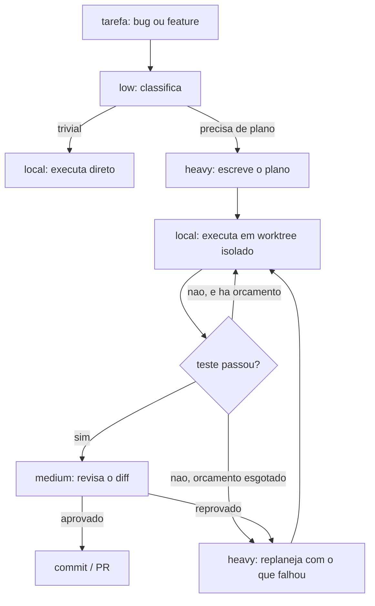

# Pipeline de desenvolvimento por camada de modelo

Como dividir trabalho entre modelos caros e baratos sem perder qualidade, e sem gastar o contexto
do modelo caro em coisa que não exige ele.

Agnóstico de modelo de propósito: as camadas são definidas por **responsabilidade**, não por nome
de modelo. Trocar de provedor é editar uma tabela.

---

## O problema, em uma frase

Num loop agêntico o custo não está em escrever código — está em **reenviar contexto**. Cada turno
manda de novo o system prompt, as definições de ferramenta, os arquivos lidos e a conversa toda.
Um bugfix de 20 linhas pode custar 200 mil tokens de entrada e 5 mil de saída.

Então a pergunta certa não é "que modelo escreve melhor?", é **"quem precisa carregar o contexto?"**

---

## As quatro camadas

| camada | responsabilidade | por que precisa (ou não) ser caro |
|---|---|---|
| **heavy** | entender o problema, decidir a arquitetura, escrever o plano | é a única etapa que exige raciocínio sobre código que ninguém explicou ainda |
| **medium** | revisar diff, julgar se o plano foi cumprido, decidir escalonamento | precisa julgar, mas sobre um diff pequeno e um plano explícito — contexto curto |
| **low** | rotular, rotear, resumir saída de ferramenta, extrair dado estruturado | é classificação, não raciocínio |
| **local** | executar plano já definido: editar arquivo, rodar teste, iterar até verde | absorve o contexto grande de graça, e é onde o volume de token está |

A economia vem de uma assimetria: **o `local` é o único que lê arquivo inteiro repetidamente**, e
é justamente o que não custa nada.

---

## O fluxo



Três regras que sustentam o desenho:

1. **Teste é o juiz, nunca o relato do modelo.** Medido: o modelo local declara "terminei" com a
   suíte vermelha em 3 de 5 tentativas. Se a pipeline acreditar nele, você recebe bug com
   aparência de feature pronta.
2. **O `heavy` nunca entra no loop de iteração.** Ele escreve o plano e sai. Só volta se o
   `local` esgotar o orçamento — e volta recebendo um resumo do que falhou, não o histórico todo.
3. **O `medium` revisa diff, não conversa.** O input dele é `git diff` mais o plano. Isso mantém
   o contexto dele em alguns milhares de tokens em vez de dezenas de milhares.

---

## Por que este desenho e não outro

Não é preferência estética. Sai de quatro medições feitas neste repositório
([`docs/benchmarks.md`](benchmarks.md)):

**O gargalo do modelo local é insight, não execução.** Na tarefa `timeline_midnight` ele acerta a
causa raiz e perde a consequência. Dando o plano, o mesmo modelo vai de 1/5 para 5/5 e gasta 4,3×
menos tokens. Isso é o que justifica a camada `heavy` existir só para planejar.

**Ele mente sobre ter terminado.** Sem plano, 3 de 5 falhas foram ele respondendo em prosa com o
teste vermelho. Daí o teste como juiz ser regra e não recomendação.

**Ele não reescreve arquivo grande.** Com apenas uma ferramenta de "escrever arquivo completo",
tentar editar um arquivo de 528 linhas estoura o limite de resposta no meio da string JSON e a
requisição morre com erro de servidor. Edição cirúrgica (`str_replace`) é requisito, não
otimização.

**Quando ele acerta, acerta rápido.** A tentativa bem-sucedida gastou 6.964 tokens contra 10-13
mil das que falharam. Isso dá um sinal de escalonamento barato: passou de ~8 mil tokens sem ficar
verde, provavelmente não vai ficar.

---

## Roteamento: que camada para que tarefa

| tarefa | camada | por quê |
|---|---|---|
| desenhar arquitetura, escolher abordagem | heavy | decisão irreversível, contexto amplo |
| investigar bug de causa desconhecida | heavy | é o caso onde o local comprovadamente falha |
| quebrar feature em passos executáveis | heavy | a qualidade do plano determina todo o resto |
| revisar diff contra o plano | medium | julgamento sobre input pequeno |
| decidir escalonar ou insistir | medium | idem |
| resumir saída de teste que falhou | low | extração, não raciocínio |
| classificar a tarefa (trivial / precisa de plano) | low | classificação |
| extrair JSON de texto | low | idem |
| aplicar plano definido em arquivo existente | **local** | volume de token, contexto grande |
| corrigir bug com teste vermelho e plano | **local** | medido: 5/5 com plano |
| escrever teste a partir de especificação | local | mecânico |
| renomear, mover, aplicar padrão repetitivo | local | idem |
| gerar boilerplate | local | é o que ele memorizou melhor |
| **corrigir bug sem plano** | ~~local~~ heavy | medido: 1/5. Não delegue |

---

## Como implementar com Cline + LiteLLM

Sua ideia de usar Cline com LiteLLM como proxy está certa, com uma ressalva importante mais
abaixo.

### LiteLLM: um alias por camada

`litellm-config.yaml`:

```yaml
model_list:
  # ── heavy: planeja e investiga ──────────────────────────────
  - model_name: heavy
    litellm_params:
      model: openrouter/<seu-modelo-forte>
      api_key: os.environ/OPENROUTER_API_KEY

  # ── medium: revisa e orquestra ──────────────────────────────
  - model_name: medium
    litellm_params:
      model: openrouter/<modelo-intermediario>
      api_key: os.environ/OPENROUTER_API_KEY

  # ── low: rotula, roteia, resume ─────────────────────────────
  - model_name: low
    litellm_params:
      model: openrouter/<modelo-barato>
      api_key: os.environ/OPENROUTER_API_KEY

  # ── local: executa plano definido ───────────────────────────
  - model_name: local
    litellm_params:
      model: openai/moe                 # alias do llama-server (-a moe)
      api_base: http://192.168.3.51:8080/v1
      api_key: local

litellm_settings:
  drop_params: true                     # o llama.cpp ignora params que nao suporta
  request_timeout: 900                  # o local é lento; o default corta a resposta

router_settings:
  # Fallback: se o local cair, a tarefa não morre — sobe uma camada.
  fallbacks: [{"local": ["medium"]}]
```

Sobe com `litellm --config litellm-config.yaml --port 4000` e o Cline aponta para
`http://localhost:4000/v1` como provider OpenAI-compatible.

**As três coisas que dão problema e vale saber antes:**

- `drop_params: true` não é opcional. O Cline manda parâmetros que o `llama-server` não conhece, e
  sem isso a requisição falha com erro que não menciona o parâmetro.
- `request_timeout` alto é obrigatório para a camada local. A 37 tok/s uma resposta longa passa
  fácil do default, e o sintoma é resposta cortada, não erro claro.
- Um perfil por vez. O `llama-server` roda em single-model mode com `-np 1`: **não dá para atender
  duas requisições locais em paralelo.** Se a pipeline tentar, a segunda espera.

### A ressalva sobre o Cline

O Cline troca de modelo por perfil, manualmente. Ele **não** roteia por tipo de tarefa dentro de
uma mesma sessão. Então na prática você vai:

1. abrir a tarefa no perfil `heavy`, pedir só o plano, e copiá-lo;
2. trocar para o perfil `local`, colar o plano, deixar executar;
3. voltar ao `medium` para revisar o diff.

Funciona, e é o caminho mais curto para começar hoje. Mas a troca é manual — o Cline não conhece
suas camadas.

Se o incômodo do vai-e-vem passar de algumas vezes por dia, o próximo passo é um orquestrador que
faça isso sozinho. O esqueleto já existe neste repositório: `scripts/bench_agentic.py` tem o loop
(ferramentas, worktree isolado, teste como juiz, teto de turnos). O que falta é a chamada ao
`heavy` para gerar o plano e ao `medium` para revisar — algumas dezenas de linhas, reutilizando
tudo o que já está lá.

---

## Orçamento e escalonamento

Regras derivadas das medições, não chutadas:

| gatilho | ação | de onde saiu |
|---|---|---|
| local passou de ~8k tokens sem verde | escala para heavy | a tentativa que acertou gastou 6,9k; as que falharam, 10-13k |
| 2 rodadas sem melhorar o placar | escala para heavy | as falhas convergiam na mesma ideia errada |
| local diz "terminei" e o teste está vermelho | continua, não escala | ele faz isso em 60% das falhas; é ruído, não sinal |
| teste passou | vai para revisão do medium | teste verde não garante código bom |
| heavy replanejou 2 vezes | para e chama a pessoa | provavelmente o problema está mal formulado |

O `heavy` recebe, ao replanejar: o plano original, o diff que o local produziu, e a saída do teste
que falhou. **Não** o histórico da conversa. É isso que impede o contexto dele de crescer.

---

## O que ainda não foi medido

Honestidade sobre os limites deste desenho:

- **A ponta de cima.** O plano que levou o local de 1/5 a 5/5 foi escrito por quem já sabia a
  resposta. Um `heavy` real vê só o teste vermelho e o código. Se ele não achar o insight distante,
  a pipeline troca um gargalo de execução por um de planejamento.
- **O custo real.** Não foi medido. A economia parece estrutural — o plano tem ~1.400 caracteres e
  o local absorve dezenas de milhares de tokens de arquivo de graça — mas isso é raciocínio, não
  número.
- **Quanto do seu trabalho é delegável.** Se a fatia "plano bem definido" for pequena, a
  complexidade de manter duas engines não se paga. Só o seu uso real responde.
- **Generalização.** A validação de 5/5 é em **uma** tarefa. Outras três fixtures existem e ainda
  não rodaram até o fim.

---

## Comece por aqui

Não construa o orquestrador primeiro. Faça isto por uma semana:

1. Cline com dois perfis: `heavy` para planejar, `local` para executar.
2. Toda tarefa que você delegar ao `local`, anote: passou? quantas idas e voltas? você teve que
   intervir?
3. Ao fim da semana você tem a taxa real de acerto **no seu trabalho**, que é o número que decide
   se vale automatizar.

Se a taxa for alta, automatizar compensa e o esqueleto já está pronto. Se for baixa, você
economizou o trabalho de construir um orquestrador para uma pipeline que não funcionaria.
